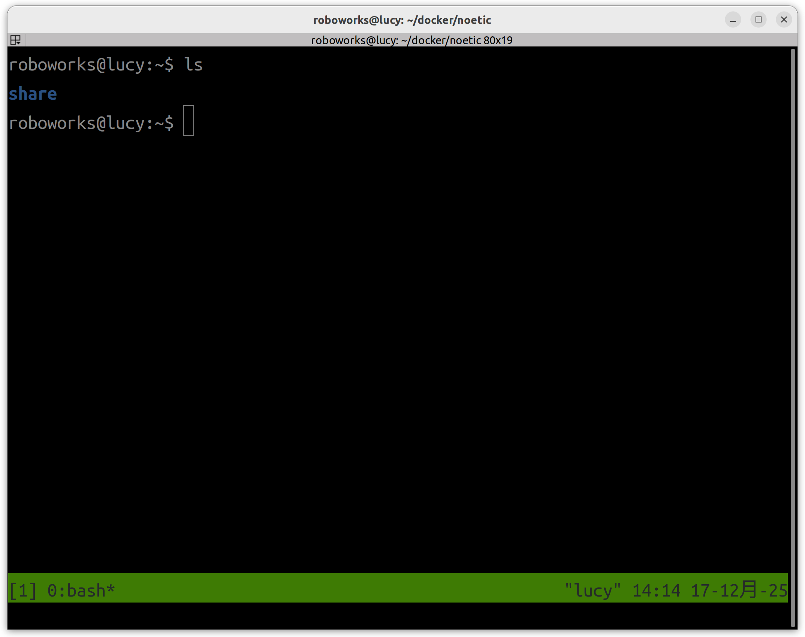

# DockerでROS(Noetic) を開発するためのテンプレート
- Ubuntu 22.04 LTS (Jammy Jellyfish)
- ROS Noetic Ninjemys

- CPU
- GPU


- okdhryk/ros:noetic-destop-full
- okdhryk/cuda:12.9.1-cudnn-devel-noetic-desktop-full


## ToDo


## メモ
[CPU環境でRVizを動かす問題](https://memoteki.net/archives/9255)

[GPU環境](https://github.com/turlucode/ros-docker-gui)

PulseAudio 経由でのみ再生可能

aplay -D pulse output2.wav

## インストール
```
(host)$ cd ~/
(host)$ git clone https://github.com/tidbots/ros-docker-dev.git
(host)$ cd ~/ros-docker-dev
```

## .envファイルの設定
1. `.env`というファイルを作成する
2. `.env_template`の内容をコピーして.envに貼り付ける
3.  ユーザ名，グループ名，ユーザID，グループID，パスワード，ホストPCと共有するディレクトリを記述する


## Docker イメージのビルド
```
(host)$ cd ~/ros-docker-dev
```
CPUバージョンのDockerイメージのビルド
```
(host)$ make build_cpu
```
GPUバージョンのDockerイメージのビルド
```
(host)$ make build_gpu
```
CPUバージョンとGPUバージョンを一度にビルド
```
(host)$ make build
```

## コンテナの起動
```
(host)$ cd ~/ros-docker-dev
```
CPUバージョンのDockerイメージのビルド
```
(host)make run_cpu
```
GPUバージョンのDockerイメージのビルド
```
(host)make run_gpu
```


 
